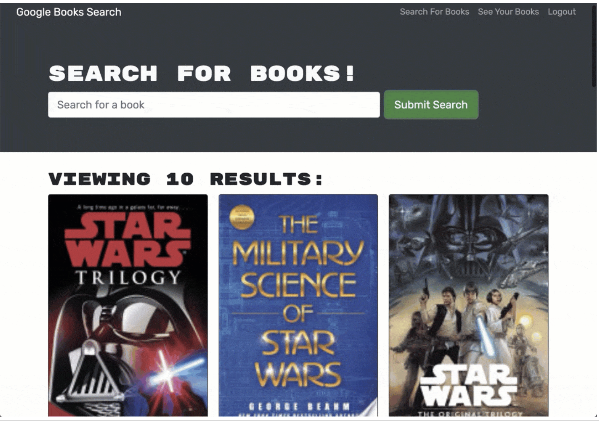

# A Book Search Engine

While this may seem like a regular MERN based book search engine, the project is a result of a refactoring exercise from RESTFUL API to use a GraphQL API. I modified the project to use GraphQL on the back end and add some functionality to the front end. 

## Table of Contents
- [Features](#features)
- [Usage](#usage)
- [Visuals](#visuals)
- [License](#license)
- [Contributing](#contributing)
- [Tests](#tests)
- [Questions](#questions)

## Features

- Set up with Apollo Server to use GraphQL queries and mutations to fetch and modify data, replacing the existing RESTful API.
- Inplementation of authentication middleware so that it works in the context of a GraphQL API.
- Introduction of Apollo Provider so that requests can communicate with an Apollo Server.

## Usage

To generate a README file for your project, run the following command:

    node index.js

Follow the prompts to provide information about your project. Once you've completed all the prompts, the README file will be generated in the current directory.

## Visuals

Application's main page

()

## Contributing

Contributions are welcome! If you have any ideas for improvements or new features, feel free to open an issue or submit a pull request.

Alternatively, you can reach me by email at jasminelassonde@gmail.com

## License

This project is licensed under the MIT License.

## Acknowledgements

This project was inspired by a need to learn more about RESTful API, GrapghQL and MERN.
